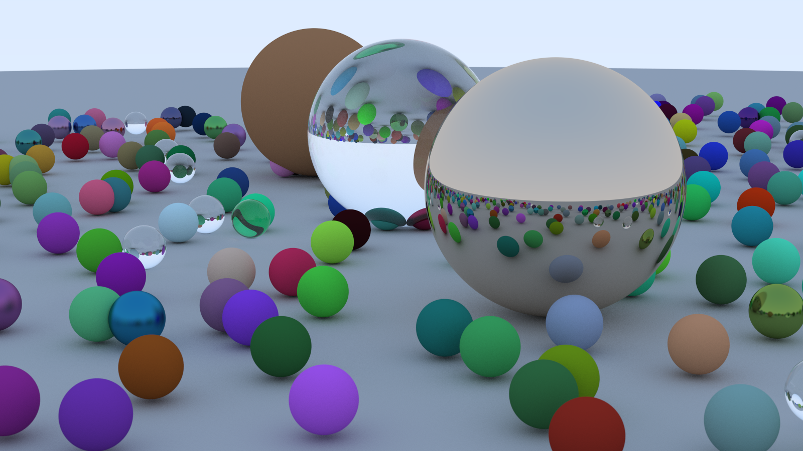

*[Ray Tracing in One Weekend](https://raytracing.github.io/books/RayTracingInOneWeekend.html)*, in
Rust instead of C++. The last few commits change it from single-threaded to multi-threaded, giving a
speedup that's close to linear for number of physical cores.

