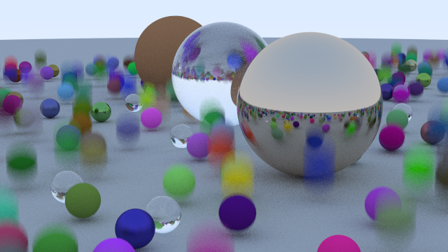

*[Ray Tracing in One Weekend](https://raytracing.github.io/books/RayTracingInOneWeekend.html)* and
its follow-up books, *[Ray Tracing: The Next
Week](https://raytracing.github.io/books/RayTracingTheNextWeek.html)*, and *[Ray Tracing: The Rest
of Your Life](https://raytracing.github.io/books/RayTracingTheRestOfYourLife.html)* (not started
yet, and jeez, so hardcore-sounding, eh?), in Rust instead of C++.

# *Ray Tracing in One Weekend*, final image:
Total render time about fifteen minutes, though that is using twelve physical cores on a fast,
modern AMD CPU. Rendered from [this commit](https://gitlab.com/nebkor/weekend-raytracer/-/commit/c95b071e835d9a35fc523b0863d103fa6ad7503c).

# *Ray Tracing: The Nex Week*

This book starts out with some interesting-looking images right away, since it's literally beginning
where the previous one ended. So I'll keep the readme updated with final chapter renders as I go.

## Chapter 2, motion blur
This [change adds moving spheres and the concept of time to the rays and
camera](https://gitlab.com/nebkor/weekend-raytracer/-/commit/9cba0fdbb83e18c392a55311970422ea6f176a3a),
and produces the following image, which took about 18 seconds to render (it's 640x360, which is
small, but motion blur adds a lot of computation). The single-threaded render time is about 12x as
long.

